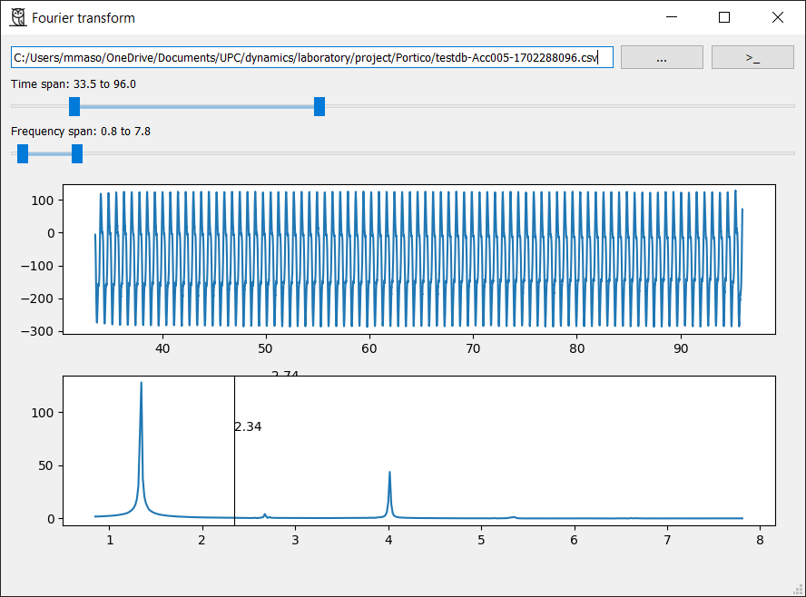

This package implements a simple GUI to calculate real positive Fourier transforms from data stored in a `.csv` file, e.g., the recording data of an accelerometer. It is aimed to be an educational resource for the structural dynamics course at the [Barcelona School of Civil Engineering](https://camins.upc.edu/en).

## Installation
On the commandline, type the following command:
```sh
pip install owlfft
```
After that, you can call the package as a module from any location, like
```sh
python -m owlfft
```

Alternatively, you can download the file `owlfft.py` into a place of your choice and make sure all the dependencies are installed,
```sh
pip install numpy scipy matplotlib pyqt5 superqt
```
Then, run the python script:
```sh
python owlfft.py
```

## Usage
The following window will be opened. It allows to select a `.csv` file and to specify how to read it (custom delimiter, columns where to read data, etc.). There are also two range sliders to trim the time and the frequency domains. Finally, a cursor is added to the FFT spectrum plot.


## Thanks
The author gratefully acknoledge [Flaticon](https://www.flaticon.com/free-icons/owl) for the design of the icon.
